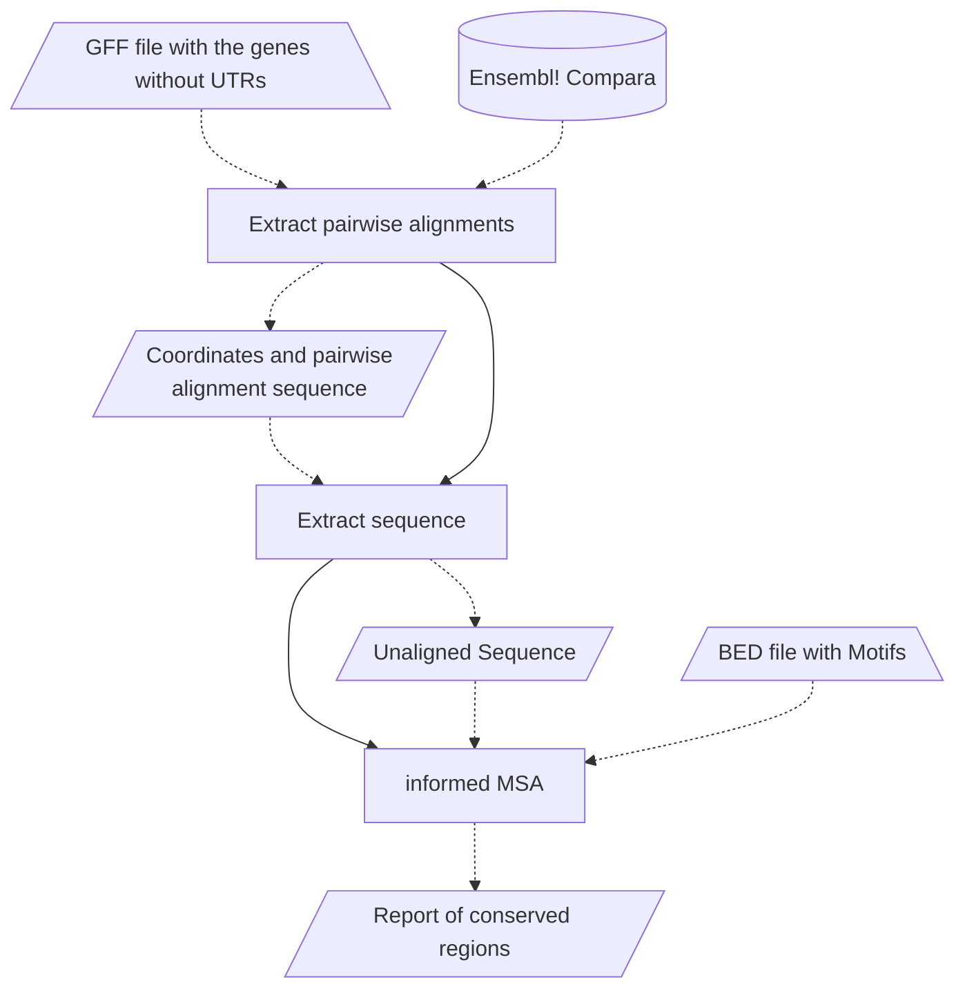

```mermaid
graph TB
    compara[(Ensembl! Compara)]
    %% genomes[(Ensembl! Genomes)]
    annotation[/GFF file with the genes without UTRs\]
    %% reference[/Genomic references\]
    motifs[/BED file with Motifs\]
    coordinates[/Coordinates and pairwise <br/> alignment sequence/]
    unaligned[/Unaligned Sequence/]
    report[/Report of conserved regions/]
    extract_coordinates[Extract pairwise alignments ]
    extract_sequences[Extract sequence]
    msa[informed MSA]
    annotation -.-> extract_coordinates
    compara -.-> extract_coordinates
    extract_coordinates -.-> coordinates
    coordinates -.-> extract_sequences
    extract_sequences -.-> unaligned
    %% reference --> extract_sequences
    %% genomes --> extract_sequences
    extract_coordinates --> extract_sequences
    extract_sequences --> msa
    unaligned -.-> msa
    motifs -.-> msa
    msa -.-> report

```
